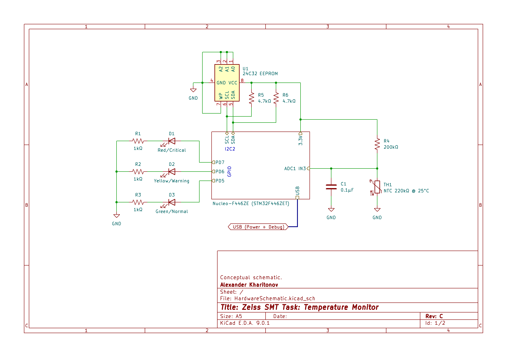

This repository contains Alexander Kharitonov's solution for an implementation task given by Zeiss SMT recruitment.

The C and C++ implementations of the task are contained in the `Embedded_Task_C` and `Embedded_Task_CPP` directories, respectively, each containing an STM32CubeIDE project targetting the hardware described below.

In each project, all task-relevant application code is contained in the `App` subdirectory. All other subdirectories contain hardware-specific driver, startup, and initialisation code, the majority of which is automatically generated by the IDE.

## Architecture

The software architecture of the C++ implementation is described in the UML diagram below.

The BSP (Board Support Package) class acts as an abstraction between the software implementation and the hardware-specific interface. In its current state, its implementation is tailored for the real hardware described below.

The specified temperature sample timing ("every 100μs, with very low jitter") is not handled by the application code itself. Instead, a hardware timer is configured to trigger the ADC directly at a frequency of 10 kHz (derived from the main system clock).

The C implementation follows the same architectural principle (just split into files, instead of classes). The corresponding functions and variables are either global or file-local.
Due to the lack of OOP features (specifically, inheritance), the separation between different hardware revisions is handled by a simple `switch` in the common temperature sensor code.

Both implementations support the hardware revisions _A_ and _B_, as defined in the specification. These assume a linear voltage-temperature relationship.

Additionally, there is support for a new hardware revision _C_, which matches the real hardware implementation described below.
Due to the use of a non-linear temperature sensing circuit (voltage divider with an NTC thermistor), a matching non-linear conversion function is implemented for this revision (using Steinhart-Hart temperature approximation).

## Hardware implementation

The following conceptual schematic describes the hardware implementation targetted by the code in this repository (_Revision C_).

The setup consists of an STM32 Nucleo development board, a prototyping board, and an off-the-shelf module for the EEPROM, as shown below.

